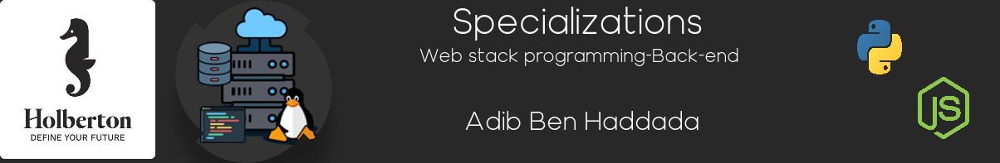

# Holberton School Web Backend

## Web Stack Introduction

A web stack is a compilation of software applications often needed for web development, especially for developing web applications and implementing websites. A web stack is a type of solution stack, which is a collection of software for performing specific tasks. Web stacks are critical components for web applications as well as websites.

A web stack is also known as a web application stack.

## What is Backend

The backend is the data access layer of a software or any device, which is not directly accessible by users. It also contains the logic of the application that handles said data. The backend also accesses the server, which is a specialized application that understands how the browser requests things.

Some of the backend programming languages are Python, PHP, Ruby, C#, and Java. Each of these languages has different frameworks that allow you to work better according to the project you are developing, such as Laravel, Django, Rails, etc.

## 📚 Content

This repository contains various projects and assignments related to backend development, including:

- Basic Authentication
- ES6 Basics
- ES6 Classes
- ES6 Data Manipulation
- ES6 Promises
- NoSQL Databases
- Session Authentication
- Unit Tests and Integration Tests
- Caching Mechanisms
- Internationalization (i18n)
- Pagination Techniques
- Handling Personal Data
- Python Async Comprehension
- Python Async Functions
- Python Variable Annotations
- User Authentication Services

## 🚀 Development Journey

Throughout the development of these projects, I encountered numerous challenges and learning opportunities. From implementing secure authentication mechanisms to handling asynchronous operations in Python, each project contributed to a deeper understanding of backend development. Some of the most difficult challenges included managing user sessions securely, optimizing data manipulation techniques, and writing comprehensive unit and integration tests.

### Implemented Features

- Secure user authentication with sessions and tokens
- Data manipulation using ES6 features
- Efficient caching strategies
- Internationalization support
- Robust unit and integration tests
- Handling and securing personal data

### Future Improvements

- Adding OAuth2 and multi-factor authentication
- Transitioning to async/await for better readability
- Implementing advanced caching strategies
- Increasing test coverage and automation
- Adding more languages for internationalization

## 🧑‍💻 About the Developer

Hello! I'm Adib ben Haddada, a passionate web developer specializing in backend technologies. I am committed to creating efficient and scalable web applications. Connect with me on [LinkedIn](https://www.linkedin.com/in/adib-ben-haddada-194ba2296/), follow me on [Twitter](https://x.com/Adib__Bh), and explore more of my work on my [Portfolio](https://github.com/your-portfolio-repo).

## Contact

- **Email:** [adibbh1996@gmail.com](mailto:adibbh1996@gmail.com)
- **GitHub:** [Adib-96](https://github.com/Adib-96)
- **Twitter:** [@Adib__Bh](https://x.com/Adib__Bh)
- **LinkedIn:** [adib ben haddada](https://www.linkedin.com/in/adib-ben-haddada-194ba2296/)
- **Website:** [your-website.com](https://your-website.com)

